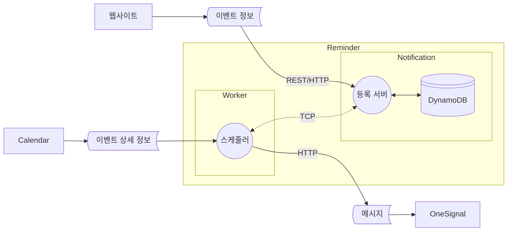
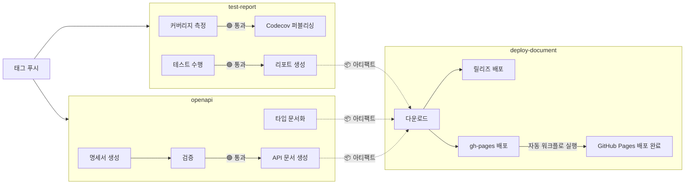

# 알림 서비스

> API를 통해 알림 시간을 관리하고, 스케쥴러가 매시간 알림을 발송하는 서비스

[](https://github.com/Daily1Hour/PickMe-Reminder-Service/releases) [](https://daily1hour.github.io/PickMe-Reminder-Service/) [](https://github.com/Daily1Hour/PickMe-Reminder-Service/actions/workflows/document-hosting.yml) [](https://codecov.io/gh/Daily1Hour/PickMe-Reminder-Service)

## 🚩 목차

- [🛠️ 기술 스택](#️-기술-스택)
- [💡 주요 기능](#-주요-기능)
- [📖 개발 문서](#-개발-문서)
    - [📄 API 명세서](#-api-명세서)
    - [📘 타입 문서](#-타입-문서)
    - [🧪 테스트 리포트](#-테스트-리포트)
- [📐 다이어그램](#-다이어그램)
    - [🔹 유즈케이스 다이어그램](#-유즈케이스-다이어그램)
    - [🔀 데이터 흐름 다이어그램](#-데이터-흐름-다이어그램)
    - [📦 배치 다이어그램](#-배치-다이어그램)
    - [🗺️ AWS 아키텍처 다이어그램](#️-aws-아키텍처-다이어그램)
    - [🚚 CI/CD 파이프라인](#-cicd-파이프라인)
- [📂 폴더 구조](#-폴더-구조)
- [🚀 실행 방법](#-실행-방법)

## 🛠️ 기술 스택

[](https://nestjs.com/) [](https://nodejs.org/ko)  
[](https://aws.amazon.com/ko/dynamodb/) [![OneSignal](https://img.shields.io/badge/OneSignal-E54B4D.svg?logo=data:image/svg+xml;base64,PHN2ZyB3aWR0aD0iMzAwIiBoZWlnaHQ9IjMwMCIgZmlsbD0ibm9uZSIgeG1sbnM9Imh0dHA6Ly93d3cudzMub3JnLzIwMDAvc3ZnIj48cGF0aCBkPSJNMTQ5LjcwMiAwQzY2Ljk0NC4xNjEtLjQ2OCA2OC4xMS4wMDIgMTUwLjg2N2MuNDE0IDc3LjI5MiA1OS4zNTYgMTQwLjc0NiAxMzQuNzU4IDE0OC4zNTVhMS43MjcgMS43MjcgMCAwIDAgMS44OTYtMS43MjRWMTQ5Ljk5OWgtMTEuNjJhMS43MjUgMS43MjUgMCAwIDEtMS43MjQtMS43MjR2LTIzLjI1M2ExLjcyIDEuNzIgMCAwIDEgMS43MjQtMS43MjRoMzYuNTg2YTEuNzI1IDEuNzI1IDAgMCAxIDEuNzI0IDEuNzI0djE3Mi40NzZhMS43MTggMS43MTggMCAwIDAgLjU2MiAxLjI4MiAxLjczOCAxLjczOCAwIDAgMCAxLjMyOS40NDJDMjQwLjkyIDI5MS41ODQgMzAwIDIyNy42OTQgMzAwIDE0OS45OTkgMzAwIDY3LjA1NyAyMzIuNjc5LS4xNjEgMTQ5LjcwMiAwem00Mi42NjcgMjY1LjgwM2ExLjcyNCAxLjcyNCAwIDAgMS0yLjI5OS0xLjYyN3YtMjQuNjJhMi41OSAyLjU5IDAgMCAxIDEuNDgzLTIuMzM0IDk2LjcyNyA5Ni43MjcgMCAwIDAgNTUuMDU3LTg3LjIyM2MwLTUzLjc3NS00NC4xNjEtOTcuNDI0LTk4LjExNS05Ni41OTctNTEuMzIxLjc4Mi05My40MTggNDIuMTU1LTk1LjA1NiA5My40NTNhOTYuNzA5IDk2LjcwOSAwIDAgMCA1NS4wMjIgOTAuMzY3IDIuNTkgMi41OSAwIDAgMSAxLjQ4OSAyLjMzNHYyNC42MjZhMS43MjMgMS43MjMgMCAwIDEtMi4yOTkgMS42MjZDNjAuMTI4IDI0OC4zNzcgMjYuMjE1IDIwMi40NyAyNi43MDMgMTQ4Ljg1IDI3LjMwNyA4MS44NjcgODIuMDI1IDI3LjIxOCAxNDkuMDMgMjYuNzAxIDIxNy40NiAyNi4xNzIgMjczLjI5OSA4MS42OSAyNzMuMjk5IDE1MGMwIDUzLjEyLTMzLjc2NCA5OC40OTktODAuOTMgMTE1LjgwNHoiIGZpbGw9IiNGRkYiLz48L3N2Zz4=&style=flat&logoColor)](https://onesignal.com/) [![OneSignal](https://img.shields.io/badge/Cron-00baa9.svg?logo=data:image/svg+xml;base64,PHN2ZyB4bWxucz0iaHR0cDovL3d3dy53My5vcmcvMjAwMC9zdmciIHhtbDpzcGFjZT0icHJlc2VydmUiIGZpbGwtcnVsZT0iZXZlbm9kZCIgc3Ryb2tlLWxpbmVqb2luPSJyb3VuZCIgc3Ryb2tlLW1pdGVybGltaXQ9IjIiIGNsaXAtcnVsZT0iZXZlbm9kZCIgdmlld0JveD0iMCAwIDM5NyA1MzQiPgogIDxwYXRoIGZpbGw9Im5vbmUiIGQ9Ik0zLTNoMzk2djUyN0gzeiIvPgogIDxwYXRoIGZpbGw9IndoaXRlIiBkPSJtMTk3IDEzMSAxNDggODZ2MTcxbC0xNDggODYtMTQ4LTg2VjIxN2wxNDgtODZaTTg2IDI5NmwxNS00NmMzNSAxMiA2MCAyMiA3NiAzMWwtNy04MWg0OGMtMSAyMS0zIDQ4LTggODEgMjMtMTEgNDktMjIgNzgtMzFsMTUgNDZjLTI4IDktNTUgMTUtODIgMTggMTMgMTIgMzIgMzMgNTYgNjJsLTM5IDI4Yy0xMy0xNy0yNy00MS00NS03MC0xNiAzMC0zMCA1NC00MiA3MGwtMzktMjhjMjUtMzEgNDQtNTIgNTQtNjItMjgtNS01NC0xMS04MC0xOFptMTI0LTE4NmMxMy0yNCA1OC0yNSA5OS0xczYzIDYyIDQ5IDg2bC0xNDgtODVabS0yNiAwYy0xNC0yNC01OC0yNS05OS0xcy02MyA2Mi00OSA4NmwxNDgtODVaIi8+CiAgPHBhdGggZmlsbD0id2hpdGUiIGQ9Ik0zMDEgODljMC0zMi00NS01OC0xMDEtNThTOTkgNTcgOTkgODljMTItMjAgNTMtMzYgMTAxLTM2czg5IDE2IDEwMSAzNlptLTE5IDM0NS0yNSAxNSAzNSA0NiAxMi03LTIyLTU0Wm0tMTY5IDAgMjQgMTUtMzUgNDYtMTItNyAyMy01NFoiLz4KPC9zdmc+Cg==&style=flat&logoColor)](https://github.com/kelektiv/node-cron) [](https://axios-http.com/kr/docs/intro)  
[![Docker Compose](https://img.shields.io/badge/Docker_Compose-2AB4FF.svg?logo=data:image/svg+xml;base64,PHN2ZyB4bWxucz0iaHR0cDovL3d3dy53My5vcmcvMjAwMC9zdmciIHZpZXdCb3g9IjAgMCA1MjMgNjY1Ij4KICA8cGF0aCBmaWxsPSIjZmNmY2ZjIiBmaWxsLXJ1bGU9ImV2ZW5vZGQiIGQ9Ik00MTggMWMtNiAxLTkgMy0xMyA4LTQgMy00IDMtMTAgMS0xMi02LTYwIDAtNjYgOC01IDYtMTEgNDQtOCA1MGwyMyAxN2M3IDQgNyA2IDIgNy0yMyAzLTM3IDI5LTI5IDUyIDMgOSAzIDktMTAgNi0xOS01LTI0LTYtNDUtNS00NyAwLTg2IDE4LTEwOSA1MGExMzUgMTM1IDAgMCAwLTI0IDY0Yy0zIDI4IDIgNDggMTcgNzJsMjIgMjdjNDAgNDQgNDEgNjYgMyA5MS00NSAzMC0xMDQgMTktMTA2LTIwLTEtMTYgNC0yOSAxNy01MiAxMy0yNCAxNC0zMyAzLTUybDEzLThjMjQtMTIgMjItOSAyMy0zNCAwLTIyIDItMjAtMjMtMzAtMTgtNi0yMC02LTQwLTEtMjggOS00MCAxNC00MSAxOCAwIDItMSAzLTIgMy03IDAtMTQgMTItMTUgMjUtMSAyMSA2IDI5IDMwIDM2IDMwIDkgMzUgMjQgMTkgNDktMzYgNTMtMzIgMTAyIDExIDEyMSAzNSAxNiA3NCAxMyAxMTktOWwxMS01IDMgMzJjMCAzNC00MCAzOC04OSA4bC0xNi0xMGMtNTEtMjktMTAyIDI0LTY2IDcwIDE1IDIwIDQyIDIxIDQ2IDIgMi04IDAtMTEtMTAtMTktMTYtMTItMTctMjQtMi0yNyA1LTEgMjYgOCAyOCAxMmwzNCAyOSAyMCAxMiAyMCA4YzM2IDEzIDgyLTE1IDgyLTUwIDAtMTAgMC0xMCA2LTUgMTAgMTAgMTggMTYgMjMgMTkgNiAzIDYgNCAxIDctNSAyLTUgMi01IDctMSA4IDEgMjkgNCAzMyA0IDcgNjMgNDYgNjkgNDYgMyAwIDQ4LTI1IDUxLTI5IDItMSAzLTM0IDEtMzZsLTE2LTljLTE2LTgtMTYtOC05LTEwIDE5LTcgMzctMjcgNDMtNDdsNS0xYTE2NSAxNjUgMCAwIDAgNjAtMTNjOSAwIDM0LTIyIDQwLTM0bDQtOGM0LTcgNi0yNiA2LTU2IDAtMjkgMS0yNy0xMC0yOS02LTItOC0zLTEzLTgtMzAtMjktNzktMjMtOTYgMTAtMyA3LTMgNy04IDlzLTYgNS01IDE3djE1YzEgMTQgNCAxNiAzNCAyOGwxMiA2YzcgMyA3IDMgMzAtNyA4LTMgOS0zIDkgMS02IDIyLTY0IDQyLTczIDI0YTg3IDg3IDAgMCAwLTYzLTQyYy04IDAtOCAwIDYtMTFhNzM2IDczNiAwIDAgMCA4NS04OWwzLTVjMTktMzEgMjEtNzMgMy0xMDctNy0xNS0yMy0zNS0zNi00OC0zOS0zNi00Ni00Ny0zOC02MiA0LTggMTUtMTcgMjAtMTVhNDUyIDQ1MiAwIDAgMCA1NS0xMmMxMS00IDEzLTUgMTQtMTAgMC00IDItNyA5LTE0IDI0LTI2LTgtODAtNDMtNzFNMjI4IDMzNGMxIDEgMCAxLTEgMS0yMCAwLTI4IDMyLTEyIDQyIDE3IDkgMzctMyAzNy0yMiAwLTctNy0xNy0xMS0xN3YtMWMzLTIgMC0zLTctNGwtNiAxbTU0IDgtNCAxYy0yMiAzLTI1IDM5LTMgNDQgMjQgNSA0MS0yMSAyNS0zOGwtNS0zdi0zYy0xLTItMTQtMy0xMy0xbS00OSAxMjBjLTYgNy05IDE0LTkgMjQgMCA4IDEgMTIgMyA2IDItMTIgOC0yOCAxMy0zM3YtM2MtMSAwLTQgMi03IDZtOTcgNGMwIDIgMjMgMTcgMjcgMTcgMiAwIDEtMy00LTctOS03LTIzLTEzLTIzLTEwbS01NCA2Yy0yMSA1MSAyOSA5NiA3MyA2NyA4LTYgOC03LTEtOC0zOS0zLTYzLTIzLTY2LTU0LTItMTItMy0xMy02LTUiLz4KPC9zdmc+Cg==&style=flat&logoColor=black)](https://docs.docker.com/compose/) [](https://www.docker.com/)  
[](https://jestjs.io/) [](https://eslint.org/) [](https://prettier.io/) [](https://www.typescriptlang.org/)  
[](https://swagger.io/) [](https://about.codecov.io/) [](https://typedoc.org/)  
[](https://github.com/features/actions)

## 💡 주요 기능

- **NestJS 프레임워크**

    - NestJS 애플리케이션 아키텍처를 활용하여 모듈과 공급자 간의 의존성 주입을 설정
    - NestJS의 전송 계층 마이크로서비스 기능을 사용하여 마이크로서비스 간 TCP 통신을 구현

- **MSA (마이크로서비스아키텍처)**

    1. **Notification 서비스**
        - 알림 리소스를 관리하는 _REST API_ 제공
        - 알림 데이터는 _Key-Value_ 데이터베이스인 **DynamoDB**에 저장
        - _DynamoDB의 TTL(Time to Live)_ 설정을 활용하여, 예약된 알림이 지나면 자동으로 삭제됨
    2. **Worker 서비스**
        - *Cron 스케줄러*를 사용하여 매시간 주기적인 작업 수행
        - Notification 서비스와 *TCP 통신*을 통해 알림 데이터를 조회
        - **OneSignal** 서비스를 통해 알림 메시지를 전송

## 📖 개발 문서

### 📄 API 명세서

> 프로젝트에서 사용되는 API 명세서입니다.  
> 이 명세서는 매 릴리즈 업데이트 시 자동으로 최신 상태로 배포됩니다.

| [](https://daily1hour.github.io/PickMe-Reminder-Service/) |
| --- |
| &nbsp;&nbsp;&nbsp;[API 명세서 바로가기](https://daily1hour.github.io/PickMe-Reminder-Service/)&nbsp;&nbsp;&nbsp; |

### 📘 타입 문서

> 프로젝트에서 사용되는 타입 정의를 문서화한 자료입니다.  
> 이 타입 문서는 매 릴리즈 업데이트 시 자동으로 최신 상태로 배포됩니다.

| [](https://daily1hour.github.io/PickMe-Reminder-Service/docs) |
| --- |
| &nbsp;&nbsp;&nbsp;[ 타입 문서 바로가기](https://daily1hour.github.io/PickMe-Reminder-Service/docs)&nbsp;&nbsp;&nbsp; |

### 🧪 테스트 리포트

> 테스트 통과 여부와 커버리지 현황은 시각적으로 제공되며, 매 릴리즈 시 자동으로 최신 상태로 반영됩니다.  
> 커버리지는 Codecov를 통해 분석됩니다. [](https://codecov.io/gh/Daily1Hour/PickMe-Reminder-Service)

| [](https://daily1hour.github.io/PickMe-Reminder-Service/test-report) | [](https://codecov.io/gh/Daily1Hour/PickMe-Reminder-Service) |
| --- | --- |
| [테스트 리포트 바로가기](https://daily1hour.github.io/PickMe-Reminder-Service/test-report) | [커버리지 대시보드 바로가기](https://codecov.io/gh/Daily1Hour/PickMe-Reminder-Service) |

<br/>

## 📐 다이어그램

### 🔹 유즈케이스 다이어그램


1. _사용자 (Actor)_
    - 웹사이트 사용자: 이벤트를 등록하고 알림을 받는 사용자
    - 알림 워커: 정기적으로 메시지를 처리하고 전송하는 시스템
2. _유즈케이스 (Use Case)_
    - 알림 등록: 사용자가 새로운 이벤트 알림을 등록하는 기능
    - 알림 삭제: 사용자가 기존에 등록된 알림을 삭제하는 기능
    - 알림 확인: 사용자가 등록된 알림 목록을 확인하는 기능
    - 메시지 상태 확인:알림 워커가 이벤트를 읽는 기능
    - 메시지 전송: 알림 워커가 메시지를 사용자에게 전송하는 기능
3. _상호작용 (Interaction)_
    - 웹사이트 사용자 ↔ 알림 서비스: 웹사이트 사용자가 이벤트 정보를 입력하여 알림 등록을 요청
    - 알림 워커 ↔ 알림 서비스: 알림 워커가 알림 서비스에 등록된 이벤트 정보를 확인
    - 알림 워커 ↔ OneSignal: 알림 워커가 OneSignal을 통해 알림 메시지를 사용자에게 전송

### 🔀 데이터 흐름 다이어그램



1. 웹사이트에서 *이벤트 정보*를 Notification 서비스 등록 서버에 REST 방식으로 전송
2. Notification 서비스는 데이터를 DynamoDB로 관리
3. Worker 서비스의 스케줄러가 정기적으로 등록 서버에서 TCP 연결로 데이터 읽음
4. 데이터가 존재하면 외부 Calendar 서비스에서 *상세 정보*를 가져옴
5. 데이터를 통합하여 *메시지*로 만들어 OneSignal로 전송

### 📦 배치 다이어그램


1. **NestJS 프레임워크**를 사용해 백엔드 서비스 구축
2. NestJS의 *MicroService 모듈*을 사용해 두 개의 마이크로서비스로 구현
3. **Notification 서비스**
    - _REST API_ 방식으로 외부 요청을 처리
    - **DynamoDB**를 사용해 데이터베이스 관리
4. **Worker 서비스**
    - *NestJS Schedule 라이브러리*를 사용해 _Cron Job_ 설정으로 주기 작업 처리
    - 마이크로서비스 간 *TCP 연결*을 통해 Notification 서비스에서 데이터 읽기
    - REST API로 외부 서비스 (Calendar 서비스)에서 데이터 요청
    - 데이터 통합하고 **OneSignal**를 통해 알림을 전송
5. 각 마이크로 서비스는 **Docker Image** 생성하여 컨테이너화
6. **Docker Compose**로 마이크로서비스와 관련 서비스(DB)를 관리하고 배포

### 🗺️ AWS 아키텍처 다이어그램


1. **ECR(Elastic Container Registery)** 에 Docker 이미지 업로드
2. **ECS(Elastic Container Service) Cluster** 생성
    - 두 서비스 간의 연결을 위해 **브릿지 모드** 설정
3. ECS의 *용량 공급자*로 **EC2 인스턴스** 생성 (_Auto Scaling_ 적용)
4. *ECR 이미지*를 기반으로 _Task Definition_ 생성
5. **Task Definition**을 바탕으로 _ECS 서비스_ 생성
6. **ECS 서비스**에서 태스크 실행 (**Auto Scaling** 적용)
7. **ALB(Application Load Balencer)** 연결을 통해 외부 트래픽 라우팅

### 🚚 CI/CD 파이프라인

&nbsp;&nbsp;&nbsp;&nbsp;&nbsp;&nbsp; <a href="https://github.com/Daily1Hour/PickMe-Reminder-Service/actions" title="GitHub Actions">  GitHub Actions 바로가기 </a>



## 📂 폴더 구조

<details>
<summary>열기</summary>

> Monorepo + Microservice  
> Clean Architecture

```bash
PickMe-Reminder-Service
├─ .github
│  ├─ workflows # 깃헙액션 워크플로어
│  │  └─ document-hosting.yml # 스웨거 및 테스터 리포트 작성
│  └─ document-index.html # 깃헙 페이지 진입점
├─ .gitignore
├─ notification # 알림 마이크로서비스
│  ├─ src
│  │  ├─ main.ts # 서버 실행 진입점
│  │  │  └─ main.test.ts
│  │  ├─ module.ts # 의존성 주입 모듈
│  │  ├─ application # 유즈케이스 계층
│  │  │  ├─ dto.ts
│  │  │  └─ service.ts # 유즈케이스
│  │  │     └─ service.spec.ts
│  │  ├─ domain # 도메인 계층
│  │  │  ├─ entity.ts # 엔티티 객체
│  │  │  └─ repository.ts # 레포지토리 인터페이스
│  │  ├─ infrastructure # 인프라스트럭쳐 계층
│  │  │  ├─ auth
│  │  │  │  ├─ jwtInterceptor.ts # JWT 토큰 인터셉터
│  │  │  │  │  └─ jwtInterceptor.test.ts
│  │  │  │  └─ verifier.ts # Cognito로 토큰 인증
│  │  │  └─ dynamo # DynamoDB
│  │  │     ├─ model.ts # 스키마
│  │  │     │  └─ model.test.ts
│  │  │     ├─ provider.ts # 프로바이더 의존성
│  │  │     │  └─ provider.test.ts
│  │  │     └─ repository.ts # 레포지토리 구현체
│  │  │        └─ repository.test.ts
│  │  ├─ presentation # 프레임워크 계층
│  │  │  ├─ controllers
│  │  │  │  ├─ healthCheckController.ts # 헬스체크
│  │  │  │  │  └─ healthCheckController.spec.ts
│  │  │  │  ├─ httpController.ts # Http API
│  │  │  │  │  └─ httpController.spec.ts
│  │  │  │  └─ messageController.ts # TCP API
│  │  │  │     └─ messageController.test.ts
│  │  │  └─ dtos # 데이터 전송 객체
│  │  │     ├─ index.ts
│  │  │     ├─ CreateRequestDTO.ts
│  │  │     ├─ ParametersDTO.ts
│  │  │     ├─ ReadRequestDTO.ts
│  │  │     └─ UpdateRequestDTO.ts
│  │  └─ utility
│  │     ├─ decorators # 커스텀 데코레이터
│  │     │  ├─ index.ts
│  │     │  ├─ AtLeastOneOption.ts # 옵션 하나 이상 유효성 검사
│  │     │  │  └─ AtLeastOneOption.test.ts
│  │     │  ├─ IsTimeRange.ts # 시간 범위 유효성 검사
│  │     │  │  └─ IsTimeRange.test.ts
│  │     │  ├─ PayloadEX.test.ts
│  │     │  │  └─ PayloadEX.ts # Payload를 dto 변환하고 데코레이터 기반 유효성 검사
│  │     │  └─ TrimSeconds.ts # 시간 데이터의 분초 삭제 변환
│  │     │     └─ TrimSeconds.test.ts
│  │     ├─ downloadOpenAPI.ts # yaml 파일로 스웨거 문서 다운로드
│  │     │  └─ downloadOpenAPI.test.ts
│  │     └─ generatorSwagger.ts # 스웨거 문서 생성
│  │        └─ generatorSwagger.test.ts
│  ├─ test
│  │  └─ app.e2e-spec.ts # end to end 테스트
│  ├─ .env # 환경변수
│  ├─ package.json # 워크스페이스 의존성 관리
│  │  └─ jest.config.js # jest 테스트 설정
│  └─ tsconfig.json # typescript 설정
│     ├─ tsconfig.build.json
│     └─ global.d.ts # 환경변수 타입
├─ worker # 알림 워커 서비스
│  ├─ src
│  │  ├─ main.ts # 서버 실행 진입점
│  │  ├─ module.ts # 의존성 주입 모듈
│  │  ├─ application
│  │  │  ├─ dto.ts # 페이로드 DTO
│  │  │  ├─ ports # 인터페이스
│  │  │  │  ├─ index.ts
│  │  │  │  ├─ client.ts # 알림 저장 서비스
│  │  │  │  ├─ receiver.ts # 메시지 수신
│  │  │  │  └─ sender.ts # 메시지 발송
│  │  │  └─ usecases
│  │  │     ├─ cron.ts # 잡 스케줄러
│  │  │     │  └─ cron.test.ts
│  │  │     └─ service.ts # 알림 TCP 요청, 발송 처리, 완료 처리
│  │  │        └─ service.test.ts
│  │  └─ infrastructure
│  │     ├─ api # axios API 인터셉터
│  │     │  ├─ index.ts
│  │     │  ├─ calendarClient.ts
│  │     │  │  └─ calendarClient.test.ts
│  │     │  └─ onesignalClient.ts
│  │     │     └─ onesignalClient.test.ts
│  │     ├─ receivers
│  │     │  └─ calendarReceiver.ts # 캘린더 서비스 구현체
│  │     │     └─ calendarReceiver.test.ts
│  │     ├─ senders
│  │     │  └─ webSender.ts # 웹 메시지 발송 구현체
│  │     │     └─ webSender.test.ts
│  │     └─ clientImpl.ts # 마이크로서비스 호출 구현체
│  │        └─ clientImpl.test.ts
│  ├─ test
│  │  └─ app.e2e-spec.ts # end to end 테스트
│  ├─ .env # 환경변수
│  ├─ package.json # 워크스페이스 의존성 관리
│  │  └─ jest.config.js # jest 테스트 설정
│  └─ tsconfig.json # typescript 설정
│     ├─ tsconfig.build.json
│     └─ global.d.ts # 환경변수 타입
├─ test # 통합 테스트
│  └─ jest.config.js
├─ .env # 공용 환경변수
├─ docker-compose.yml # 도커컴포즈
│  ├─ Dockerfile.notification # 알림 마이크로서비스 도커파일
│  └─ Dockerfile.worker # 워커 마이크로서비스 도커파일
├─ package.json # 의존성 관리
│  ├─ package-lock.json
│  ├─ .eslintrc.js # eslint 린터 설정
│  ├─ .eslintignore # eslint 무시 설정
│  ├─ .prettierrc # 포맷터 설정
│  ├─ jest.config.js # jest 테스트 설정
│  └─ nest-cli.json # nestjs 모듈 구조 설정
└─ tsconfig.json # typescript 설정
   └─ typedoc.json # 문서 설정
```

</details>

## 🚀 실행 방법

### 도커환경

```sh
# build
$ docker-compose build

# run
$ docker-compose up -d
```

### 로컬환경

```sh
$ npm install

# build
$ npm run build

# development
$ npm run start
```
